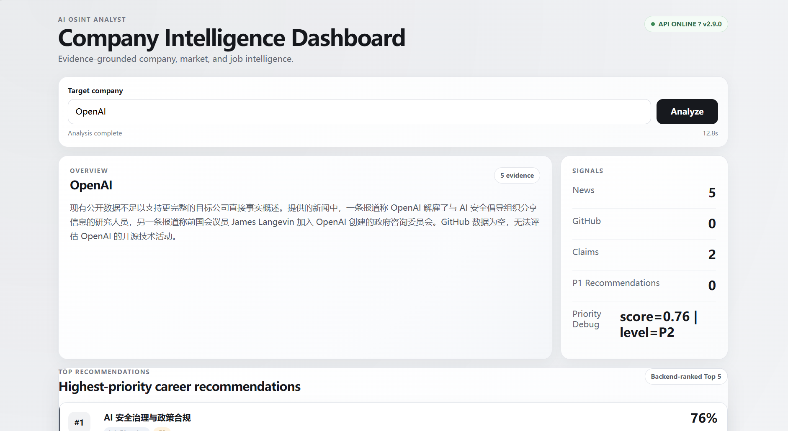
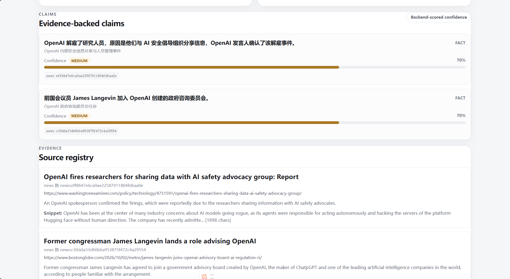
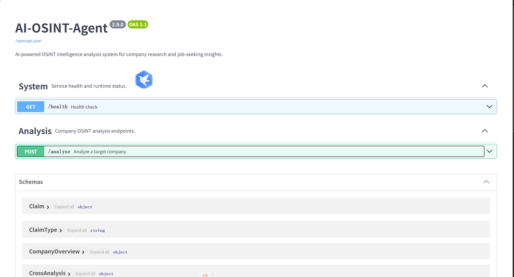

# AI-OSINT-Agent

> **Evidence-grounded company intelligence for job seekers.**

AI-OSINT-Agent is an AI-powered OSINT analysis system that collects public GitHub and news signals about a target company, converts them into structured evidence, validates LLM-generated claims and recommendations, and presents the final result through a web dashboard.

The project focuses on a practical problem in AI-assisted company research:

**How can LLM-generated job-seeking insights remain structured, traceable, and evidence-grounded instead of becoming unsupported summaries?**

---

## Demo

### Dashboard



### Evidence Traceability



### API Documentation



## Overview

AI-OSINT-Agent is designed for company research and job-seeking intelligence.

Given a target company such as `OpenAI`, the system builds this pipeline:

```text
GitHub / News
      ↓
Service Layer
      ↓
Company Intelligence
      ↓
Evidence Builder
      ↓
Structured LLM Analysis
      ↓
JSON Parse Boundary
      ↓
Pydantic Schema Validation
      ↓
Evidence / Claim / Recommendation Validators
      ↓
Confidence & Priority
      ↓
Category-aware Top 5
      ↓
FastAPI
      ↓
Dashboard
```

The final output is not only a company summary. It contains structured:

- Company Overview
- GitHub Signals
- News Signals
- Cross Analysis
- Claims
- Job Value
- Interview Preparation
- Recommendations
- Evidence references
- Confidence and priority information

---

## Why This Project

Many LLM-based company research tools stop at:

```text
Search → LLM → Summary
```

This project uses a stricter pipeline:

```text
Search → Evidence → Structured Analysis → Validation → Recommendation
```

The system separates:

1. **Evidence** — public information collected from GitHub and news sources.
2. **Claims** — structured statements derived from evidence.
3. **Recommendations** — job-seeking implications derived from validated claims.
4. **Validation** — rules that check whether evidence, claims, and recommendations remain structurally and semantically consistent.

This makes the reasoning process observable and traceable rather than treating the LLM response as the final source of truth.

---

## Core Capabilities

### 1. GitHub Intelligence

The system collects structured repository information such as repository name, description, stars, forks, programming language, updated time, and repository URL.

GitHub data is normalized through a dedicated service layer before entering the analysis pipeline.

### 2. News Intelligence

News sources are converted into structured objects containing information such as title, summary or content, publication time, source, language, and URL.

News evidence is further classified according to its role and relevance in the analysis.

### 3. Evidence Grounding

Evidence is treated as a first-class object rather than raw text passed directly to the LLM.

Evidence identifiers are preserved so that downstream claims and recommendations remain traceable.

### 4. Structured LLM Output

The LLM is constrained by an authoritative output schema.

```text
LLM generation
      ↓
JSON parsing
      ↓
Pydantic validation
      ↓
Business validation
      ↓
Final report
```

Malformed or structurally invalid model output is prevented from directly becoming the API response.

### 5. Claim Validation

Claims are validated against referenced evidence and their declared semantics.

The current model distinguishes:

- `FACT`
- `COMPETITIVE`
- `INFERENCE`
- `CAUSAL`
- `INDUSTRY`

### 6. Recommendation Validation

Recommendations are connected back to validated claims.

Recommendation evidence references are derived from claim references rather than blindly trusting LLM-generated evidence IDs.

The resulting traceability chain is:

```text
Evidence
   ↓
Claim
   ↓
Recommendation
```

### 7. Category-aware Top 5

The system produces a compact Top 5 decision-support layer across categories such as:

- Job Direction
- Technical Skill
- Important Area
- Interview Topic
- Practical Task

---

## System Architecture

```text
┌─────────────────────┐
│   GitHub Sources    │
└──────────┬──────────┘
           │
┌──────────▼──────────┐
│   GitHub Service    │
└──────────┬──────────┘
           │
           │
┌──────────▼──────────┐
│ Company Intelligence│
└──────────┬──────────┘
           │
┌──────────▼──────────┐
│   Evidence Builder  │
└──────────┬──────────┘
           │
           ▼
┌─────────────────────┐
│ Structured LLM      │
│ Analysis            │
└──────────┬──────────┘
           │
           ▼
┌─────────────────────┐
│ JSON Parse Boundary │
└──────────┬──────────┘
           │
           ▼
┌─────────────────────┐
│ Pydantic Schemas    │
└──────────┬──────────┘
           │
           ▼
┌─────────────────────┐
│ Validators          │
│ Evidence / Claims   │
│ Recommendations     │
└──────────┬──────────┘
           │
           ▼
┌─────────────────────┐
│ Confidence /        │
│ Priority            │
└──────────┬──────────┘
           │
           ▼
┌─────────────────────┐
│ Category-aware Top 5│
└──────────┬──────────┘
           │
           ▼
┌─────────────────────┐
│ FastAPI             │
└──────────┬──────────┘
           │
           ▼
┌─────────────────────┐
│ Dashboard           │
└─────────────────────┘
```

---

## Core Design Principles

### Evidence First

The pipeline is built around explicit evidence objects instead of treating retrieved text as an implicit source.

### Structured Output

LLM responses are parsed into explicit Pydantic models before becoming part of the application result.

### Validation at Boundaries

Important transitions are validated explicitly:

```text
retrieval
→ structured objects
→ LLM JSON
→ Pydantic models
→ business validators
→ final report
```

### Traceable Recommendations

Recommendations are not isolated natural-language outputs. They are connected to claims, and claims are connected to evidence.

### Separation of Concerns

The project separates data retrieval, service logic, evidence construction, LLM analysis, schema validation, business validation, recommendation generation, API delivery, and frontend presentation.

---

## Tech Stack

### Backend

- Python
- FastAPI
- Uvicorn
- Pydantic v2
- OpenAI-compatible client
- DeepSeek API

### Frontend

- HTML
- CSS
- Vanilla JavaScript

### Data Sources

- GitHub
- News sources

---

## Project Structure

```text
AI-OSINT-Agent/
│
├── backend/
│   ├── main.py
│   ├── llm.py
│   ├── models/
│   ├── services/
│   ├── validators/
│   └── ...
│
├── frontend/
│   ├── index.html
│   ├── styles.css
│   ├── app.js
│   └── README.md
│
├── README.md
└── ...
```

---


## Quick Start

### Backend

```powershell
cd D:\PycharmProject\AI-OSINT-Agent\backend
python -m uvicorn main:app --host 127.0.0.1 --port 8010
```

Backend API:

```text
http://127.0.0.1:8010
```

Health check:

```text
http://127.0.0.1:8010/health
```

### Frontend

Open another terminal:

```powershell
cd D:\PycharmProject\AI-OSINT-Agent\frontend
python -m http.server 5173
```

Frontend:

```text
http://127.0.0.1:5173/
```

---

## Demo / Deployment

### Local Demo

The project can be run locally with a FastAPI backend and a static frontend.

#### 1. Configure environment variables

Create `backend/.env` from `.env.example` and provide the required credentials:

```text
API_KEY=your_api_key
GITHUB_TOKEN=your_github_token
GNEWS_API_KEY=your_gnews_api_key
```

Do not commit real credentials.

#### 2. Start the backend

```powershell
cd backend
python -m uvicorn main:app --host 127.0.0.1 --port 8010
```

#### 3. Start the frontend

In another terminal:

```powershell
cd frontend
python -m http.server 5173
```

Open `http://127.0.0.1:5173/`.

#### 4. Verify the backend

```powershell
python -c "import requests; r=requests.get('http://127.0.0.1:8010/health'); print(r.status_code); print(r.json())"
```

#### 5. Run an analysis

```powershell
python -c "import requests; r=requests.post('http://127.0.0.1:8010/analyze',params={'keyword':'OpenAI'},timeout=180); print(r.status_code); print(len(r.json()['top_recommendations']))"
```

A successful response returns a structured report containing evidence, signals, cross-analysis, job value, interview preparation, reliability, and category-aware Top 5 recommendations.

### Current Deployment Scope

The current project is designed and validated as a local portfolio/demo application.

For a production deployment, move the API base URL, CORS configuration, secret management, and external service configuration to deployment-specific environment settings.


## API

### Health Check

```http
GET /health
```

Example response:

```json
{
  "status": "ok",
  "service": "AI-OSINT-Agent",
  "version": "2.9.0"
}
```

### Company Analysis

```http
POST /analyze?keyword=OpenAI
```

The endpoint returns a structured `JobAnalysisReport` containing company intelligence, evidence, claims, recommendations, job value, interview preparation, confidence information, and related analysis fields.

---

## Dashboard

The frontend follows a decision-oriented reading hierarchy:

```text
1. Overview
2. Top Recommendations
3. Job Value
4. Interview Preparation
5. News / GitHub Signals
6. Claims
7. Evidence
```

The intended reading path is:

```text
What the company is
        ↓
What matters for job seekers
        ↓
Why these recommendations exist
        ↓
What evidence supports them
```

The dashboard is designed as a decision-support interface rather than a raw API response viewer.

---

## Core Pipeline

The core design of AI-OSINT-Agent is an evidence-grounded transformation pipeline:

```text
Evidence
   ↓
Claim
   ↓
Recommendation
   ↓
Category-aware Top 5
```

These are separate application objects and validation stages rather than one free-form LLM response.

### 1. Evidence

GitHub repositories and news articles are normalized by the service layer and converted into explicit evidence objects.

The evidence layer answers:

> **What public information do we actually have?**

Source identity and supporting content remain explicit so downstream claims can be traced back to the underlying material.

### 2. Claims

Claims are structured statements derived from evidence.

The system distinguishes `FACT`, `COMPETITIVE`, `INFERENCE`, `CAUSAL`, and `INDUSTRY` claim semantics.

A claim is not accepted simply because the LLM generated it. Its evidence references, semantic relationship, and claim type are checked by the validation layer.

The validator also prevents competitive or industry context from being silently promoted into unsupported direct company facts.

### 3. Recommendations

Recommendations translate validated claims into job-seeking implications.

They are classified into `JOB_DIRECTION`, `TECHNICAL_SKILL`, `IMPORTANT_AREA`, `INTERVIEW_TOPIC`, and `PRACTICAL_TASK`.

Recommendation evidence is not accepted blindly from the LLM. Evidence identifiers are derived from validated claim references.

```text
Evidence
   ↓
Claim
   ↓
Recommendation
```

This makes each recommendation auditable.

### 4. Category-aware Top 5

The full recommendation set is reduced only after validation and prioritization:

```text
All Recommendations
        ↓
Validated Recommendations
        ↓
Confidence / Priority
        ↓
Category-aware Selection
        ↓
Top 5
```

The selection layer preserves category coverage and provides a compact dashboard view while the complete validated report remains available.

### 5. LLM-to-Application Boundary

The LLM generates structured analysis candidates. Python application logic determines whether those candidates satisfy application rules.

```text
LLM
 ↓
Structured JSON Candidate
 ↓
JSON Parse Boundary
 ↓
Pydantic Schema Validation
 ↓
Business Validation
 ↓
Validated Claims / Recommendations
 ↓
Top 5 Selection
```

This prevents malformed JSON, invalid references, unsupported claims, or untraceable recommendations from silently becoming final API output.

### 6. End-to-end Traceability

For a target company such as `OpenAI`:

```text
Public GitHub / News
        ↓
Evidence
        ↓
Validated Claim
        ↓
Validated Recommendation
        ↓
Category + Confidence + Priority
        ↓
Category-aware Top 5
        ↓
Dashboard
```

The retrieved evidence changes with the target company, while the validation and transformation pipeline remains consistent.


## Validation / Evidence Design

The validation layer is designed to prevent raw LLM output from becoming application truth without structural and semantic checks.

### 1. Evidence Roles

The system distinguishes evidence according to how it relates to the target company:

```text
Direct company evidence
        |
        +-- Company-specific facts

Competitive evidence
        |
        +-- Rival or competitor context

Industry evidence
        |
        +-- Regulatory, research, market,
            benchmark, or ecosystem context
```

These roles are not interchangeable. For example, industry or competitive context should not silently become a direct factual claim about the target company.

### 2. Claim Semantics

Claims are explicitly classified into:

- `FACT`
- `COMPETITIVE`
- `INFERENCE`
- `CAUSAL`
- `INDUSTRY`

Claim validation checks both the declared semantics and the evidence that is allowed to support that type of claim.

This is important because the same piece of evidence can have different implications depending on whether the system is making a direct fact, competitive comparison, industry statement, inference, or causal statement.

### 3. Evidence-to-Claim Consistency

A claim is accepted only when its evidence references are consistent with the enclosing analysis context and the declared claim semantics.

The validator checks relationships such as:

```text
Evidence
   |
   +-- supports --> Claim
                     |
                     +-- claim type
                     +-- semantic relationship
                     +-- evidence references
```

The purpose is to prevent unsupported claims from passing only because the LLM produced plausible natural language.

### 4. Recommendation Traceability

Recommendations are derived from validated claims rather than treated as independent model output.

```text
Evidence
   |
   v
Validated Claim
   |
   v
Recommendation
```

Recommendation evidence references are derived from claim references. The validator also checks recommendation support and semantic overlap before the recommendation is accepted.

This makes a recommendation auditable from the final dashboard back to the underlying evidence.

### 5. Company Overview Scope

Company overview evidence is restricted to evidence that directly supports the target company.

Competitive and industry context can remain useful in cross-analysis, but it should not be promoted into direct company facts merely because it appears in the same report.

### 6. Cross-Analysis Context

Cross-analysis can legitimately use competitive or industry context when the relationship itself is explicitly contextual.

At the same time, the validation layer prevents industry-only evidence from being used to make unsupported causal claims about the target company.

This preserves useful contextual analysis without weakening the evidence boundary.

### 7. Final Recommendation Boundary

The final Top 5 layer is built only after validation and prioritization:

```text
Raw LLM Output
      |
      v
Parsed Structured Output
      |
      v
Validated Claims
      |
      v
Validated Recommendations
      |
      v
Confidence / Priority
      |
      v
Category-aware Top 5
```

The Top 5 object must remain consistent with its source recommendation. The selection layer therefore does not replace validation; it operates after validation.

### Design Goal

The overall rule is:

> **Generate with the LLM, decide with application rules, and preserve the evidence trail.**

This architecture treats model output as a structured candidate rather than an unquestioned source of truth.


## Validation & Testing

Validation is part of the application architecture rather than an optional post-processing step.

The project includes checks for areas such as:

- Schema validity
- Evidence reference consistency
- Claim-to-evidence relationships
- Claim semantics
- Recommendation traceability
- Recommendation category constraints
- Evidence-role consistency
- Top recommendation consistency
- JSON parsing boundaries

The validation layer is intentionally strict so that invalid or unsupported model output does not silently become application truth.

---

## Limitations

The current system is based on public-source intelligence and automated model reasoning.

Therefore:

- Retrieved public information may be incomplete.
- News relevance depends on source quality and retrieval coverage.
- LLM-generated interpretations may still require human review.
- Recommendations should be treated as decision-support information rather than objective truth.
- The current frontend is optimized for local demonstration and portfolio presentation.

---

## Roadmap

### V2.9

- Runtime / API contract
- Health check
- API documentation
- Frontend portfolio polish
- README and architecture documentation
- Demo / deployment readiness

### Future Extensions

Potential future directions include:

- More OSINT data sources
- Historical company intelligence
- Multi-company comparison
- Job-posting integration
- Richer evidence graphs
- More advanced recommendation ranking
- Deployment-oriented infrastructure

---

## License

This project is intended as a portfolio and engineering demonstration project.
